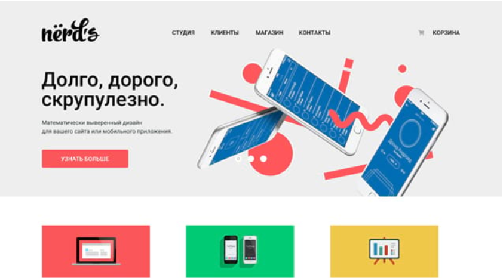
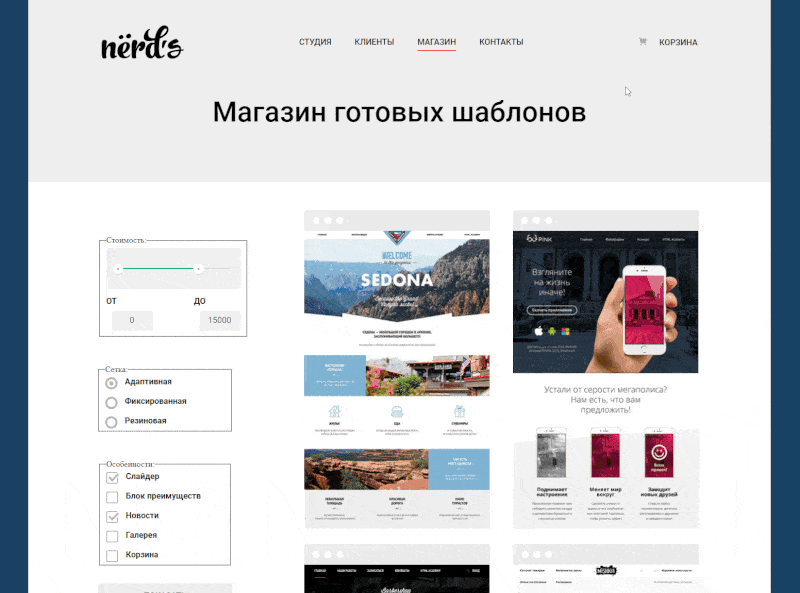

  

## О проекте

##### Nerds - сайт дизайн-студии из Краснодара.   Представляет собой типовой сайт, подходящий для небольшой компании.

(Simple multi-page website. Desktop only.)

- HTML
- CSS
- Flex Layout
- Grid Layout
- Анимации и трансформации
- Используемая методология: БЭМ
- Реализация модальных окон, слайдера с использованием JS

## 

### Автор

- [**Stanislav Kazankov**](https://github.com/kazankovstas/) - _HTML Academy Student_
